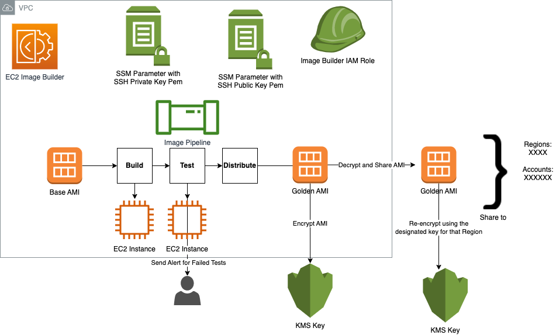

# AWS EC2 Image Builder Module

This terraform module can be used to deploy [AWS EC2 Image Builder](https://aws.amazon.com/image-builder/).

   ✅ Deployment examples can be found under [examples](https://github.com/aws-ia/terraform-aws-ec2-image-builder/tree/main/examples) folder.

   ✅ AWS EC2 image builder documentation for more details about [AWS EC2 Image Builder](https://docs.aws.amazon.com/imagebuilder/)

## AWS EC2 Image Builder Architecture

<p align="center">
  
</p>

## Usage

The example below builds an EC2 Image using EC2 Image Builder in an existing VPC and Subnets.
EC2 Image Builder simplifies the building, testing, and deployment of Virtual Machine and container images for use on AWS or on-premises.
EC2 Image Builder supporting resources EC2 Key Pair, IAM role and Security groups are created by this module by default.
This module allows you to bring your own EC2 Key Pair, additional IAM Policy and Security group.

The following is a basic example, see examples folder for more complete examples:

```hcl
module "ec2-image-builder" {
  source                = "aws-ia/ec2-image-builder/aws"
  name                = "basic-ec2-image"
  vpc_id              = "<ENTER_VPC_ID>"
  subnet_id           = "<ENTER_SUBNET_ID>"
  aws_region          = "<ENTER_AWS_REGION>"
  source_cidr         = ["<ENTER your IP here to access EC2 Image Builder Instances through RDP or SSH>"] 
  create_security_group = true
  create_key_pair     = true
  instance_types      = ["c5.large"]
  source_ami_name     = "<ENTER_SOURCE_AMI_NAME>" # e.g.: "Windows_Server-2022-English-Core-Base-*"
  ami_name            = "<ENTER_AMI_NAME>" # e.g.: "Windows 2022 core AMI"
  ami_description     = "<ENTER_AMI_DESCRIPTION>" # e.g.:  "Windows 2022 core AMI provided by AWS"
  recipe_version      = "0.0.1"
  build_component_arn = ["<ENTER_LIST_OF_BUILD_ARNS>"] # e.g.:  arn:aws:imagebuilder:ap-southeast-2:XXXXXXXXXXX:component/win2022build/0.0.1/1
  test_component_arn  = ["<ENTER_LIST_OF_TEST_ARNS>"] # e.g.: arn:aws:imagebuilder:ap-southeast-2:XXXXXXXXXXXX:component/win2022test/0.0.1/1
  s3_bucket_name      = "<ENTER_S3_BUCKET_NAME>"
  custom_policy_arn   = "<ENTER_CUSTOM_POLICY_ARN>"
  platform            = "<Windows or Linux>"
  tags                = "<ENTER_A_MAP_OF_RESOURCE_TAGS_TO_ASSOCIATE_WITH_THE_RESOURCES>"

  managed_components = "<ENTER_LIST OF AWS MANAGED COMPONENTS>" 
  # e.g.:
  #managed_components = [{
  #  name    = "powershell-windows",
  #  version = "7.2.10"
  #  },
  #  {
  #    name    = "chocolatey",
  #    version = "1.0.0"
  #}]

  target_account_ids = [
    "<ENTER TARGET AWS ACCOUNT IDS.>"
  ]

  ami_regions_kms_key = {
    "<ENTER AWS REGIONS TO SHARE THE AMI WITH>" = "<ENTER KMS KEYs TO ENCRYPT AMIs ON THE TARGET REGION>",
    "us-west-2"      = "arn:aws:kms:us-west-2:XXXXXXX:key/mrk-XXXXXX",
    "us-east-1"      = "arn:aws:kms:us-east-1:XXXXXX:key/mrk-XXXX",
  }

}

```

## Security

See [CONTRIBUTING](CONTRIBUTING.md#security-issue-notifications) for more information.

## License

Apache-2.0 Licensed. See [LICENSE](https://github.com/aws-ia/terraform-aws-ec2-image-builder/blob/main/LICENSE).