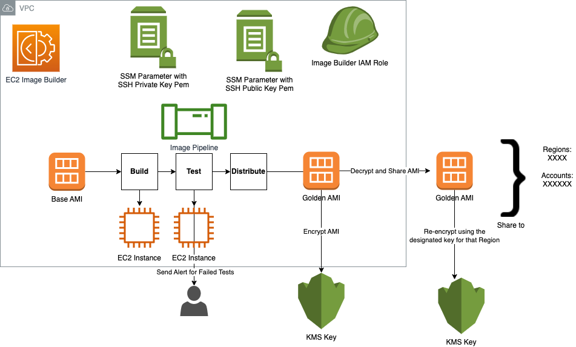

<!-- BEGIN_TF_DOCS -->
# AWS EC2 Image Builder Module

This terraform module can be used to deploy [AWS EC2 Image Builder](https://aws.amazon.com/image-builder/).

   ✅ Deployment examples can be found under [examples](https://github.com/aws-ia/terraform-aws-ec2-image-builder/tree/main/examples) folder.

   ✅ AWS EC2 image builder documentation for more details about [AWS EC2 Image Builder](https://docs.aws.amazon.com/imagebuilder/)

## AWS EC2 Image Builder Architecture

{ width=100% }

## Usage

The example below builds an EC2 Image using EC2 Image Builder in an existing VPC and Subnets.
EC2 Image Builder simplifies the building, testing, and deployment of Virtual Machine and container images for use on AWS or on-premises.
EC2 Image Builder supporting resources EC2 Key Pair, IAM role and Security groups are created by this module by default.
This module allows you to bring your own EC2 Key Pair, additional IAM Policy and Security group.

The following is a basic example, see examples folder for more complete examples:

```hcl
module "ec2-image-builder" {
  source                = "aws-ia/ec2-image-builder/aws"
  name                = "basic-ec2-image"
  vpc_id              = "<ENTER_VPC_ID>"
  subnet_id           = "<ENTER_SUBNET_ID>"
  aws_region          = "<ENTER_AWS_REGION>"
  source_cidr         = ["<ENTER your IP here to access EC2 Image Builder Instances through RDP or SSH>"]
  create_security_group = true
  create_key_pair     = true
  instance_types      = ["c5.large"]
  source_ami_name     = "<ENTER_SOURCE_AMI_NAME>" # e.g.: "Windows_Server-2022-English-Core-Base-*"
  ami_name            = "<ENTER_AMI_NAME>" # e.g.: "Windows 2022 core AMI"
  ami_description     = "<ENTER_AMI_DESCRIPTION>" # e.g.:  "Windows 2022 core AMI provided by AWS"
  recipe_version      = "0.0.1"
  build_component_arn = ["<ENTER_LIST_OF_BUILD_ARNS>"] # e.g.:  arn:aws:imagebuilder:ap-southeast-2:XXXXXXXXXXX:component/win2022build/0.0.1/1
  test_component_arn  = ["<ENTER_LIST_OF_TEST_ARNS>"] # e.g.: arn:aws:imagebuilder:ap-southeast-2:XXXXXXXXXXXX:component/win2022test/0.0.1/1
  s3_bucket_name      = "<ENTER_S3_BUCKET_NAME>"
  custom_policy_arn   = "<ENTER_CUSTOM_POLICY_ARN>"
  platform            = "<Windows or Linux>"
  tags                = "<ENTER_A_MAP_OF_RESOURCE_TAGS_TO_ASSOCIATE_WITH_THE_RESOURCES>"

  managed_components = "<ENTER_LIST OF AWS MANAGED COMPONENTS>"
  # e.g.:
  #managed_components = [{
  #  name    = "powershell-windows",
  #  version = "7.2.10"
  #  },
  #  {
  #    name    = "chocolatey",
  #    version = "1.0.0"
  #}]

  target_account_ids = [
    "<ENTER TARGET AWS ACCOUNT IDS.>"
  ]

  ami_regions_kms_key = {
    "<ENTER AWS REGIONS TO SHARE THE AMI WITH>" = "<ENTER KMS KEYs TO ENCRYPT AMIs ON THE TARGET REGION>",
    "us-west-2"      = "arn:aws:kms:us-west-2:XXXXXXX:key/mrk-XXXXXX",
    "us-east-1"      = "arn:aws:kms:us-east-1:XXXXXX:key/mrk-XXXX",
  }

}

```

## Security

See [CONTRIBUTING](CONTRIBUTING.md#security-issue-notifications) for more information.

## License

Apache-2.0 Licensed. See [LICENSE](https://github.com/aws-ia/terraform-aws-ec2-image-builder/blob/main/LICENSE).

## Requirements

| Name | Version |
|------|---------|
| <a name="requirement_terraform"></a> [terraform](#requirement\_terraform) | >= 1.0.7 |
| <a name="requirement_aws"></a> [aws](#requirement\_aws) | >= 4.0.0, < 5.0.0 |
| <a name="requirement_awscc"></a> [awscc](#requirement\_awscc) | >= 0.24.0 |

## Providers

| Name | Version |
|------|---------|
| <a name="provider_aws"></a> [aws](#provider\_aws) | >= 4.0.0, < 5.0.0 |

## Modules

No modules.

## Resources

| Name | Type |
|------|------|
| [aws_iam_instance_profile.iam_instance_profile](https://registry.terraform.io/providers/hashicorp/aws/latest/docs/resources/iam_instance_profile) | resource |
| [aws_iam_role.awsserviceroleforimagebuilder](https://registry.terraform.io/providers/hashicorp/aws/latest/docs/resources/iam_role) | resource |
| [aws_iam_role_policy.aws_policy](https://registry.terraform.io/providers/hashicorp/aws/latest/docs/resources/iam_role_policy) | resource |
| [aws_iam_role_policy_attachment.custom_policy](https://registry.terraform.io/providers/hashicorp/aws/latest/docs/resources/iam_role_policy_attachment) | resource |
| [aws_iam_role_policy_attachment.imagebuilder](https://registry.terraform.io/providers/hashicorp/aws/latest/docs/resources/iam_role_policy_attachment) | resource |
| [aws_iam_role_policy_attachment.ssm](https://registry.terraform.io/providers/hashicorp/aws/latest/docs/resources/iam_role_policy_attachment) | resource |
| [aws_imagebuilder_distribution_configuration.imagebuilder_distribution_configuration](https://registry.terraform.io/providers/hashicorp/aws/latest/docs/resources/imagebuilder_distribution_configuration) | resource |
| [aws_imagebuilder_image.imagebuilder_image](https://registry.terraform.io/providers/hashicorp/aws/latest/docs/resources/imagebuilder_image) | resource |
| [aws_imagebuilder_image_pipeline.imagebuilder_image_pipeline](https://registry.terraform.io/providers/hashicorp/aws/latest/docs/resources/imagebuilder_image_pipeline) | resource |
| [aws_imagebuilder_image_recipe.imagebuilder_image_recipe](https://registry.terraform.io/providers/hashicorp/aws/latest/docs/resources/imagebuilder_image_recipe) | resource |
| [aws_imagebuilder_infrastructure_configuration.imagebuilder_infrastructure_configuration](https://registry.terraform.io/providers/hashicorp/aws/latest/docs/resources/imagebuilder_infrastructure_configuration) | resource |
| [aws_security_group.security_group](https://registry.terraform.io/providers/hashicorp/aws/latest/docs/resources/security_group) | resource |
| [aws_security_group_rule.sg_https_ingress](https://registry.terraform.io/providers/hashicorp/aws/latest/docs/resources/security_group_rule) | resource |
| [aws_security_group_rule.sg_internet_egress](https://registry.terraform.io/providers/hashicorp/aws/latest/docs/resources/security_group_rule) | resource |
| [aws_security_group_rule.sg_rdp_ingress](https://registry.terraform.io/providers/hashicorp/aws/latest/docs/resources/security_group_rule) | resource |
| [aws_ami.source_ami](https://registry.terraform.io/providers/hashicorp/aws/latest/docs/data-sources/ami) | data source |
| [aws_iam_policy_document.assume](https://registry.terraform.io/providers/hashicorp/aws/latest/docs/data-sources/iam_policy_document) | data source |
| [aws_iam_policy_document.aws_policy](https://registry.terraform.io/providers/hashicorp/aws/latest/docs/data-sources/iam_policy_document) | data source |
| [aws_imagebuilder_components.managed_components](https://registry.terraform.io/providers/hashicorp/aws/latest/docs/data-sources/imagebuilder_components) | data source |
| [aws_vpc.selected](https://registry.terraform.io/providers/hashicorp/aws/latest/docs/data-sources/vpc) | data source |

## Inputs

| Name | Description | Type | Default | Required |
|------|-------------|------|---------|:--------:|
| <a name="input_ami_description"></a> [ami\_description](#input\_ami\_description) | (Required) Choose a description for the AMI | `string` | n/a | yes |
| <a name="input_ami_name"></a> [ami\_name](#input\_ami\_name) | (Required) Choose a name for the AMI | `string` | n/a | yes |
| <a name="input_aws_region"></a> [aws\_region](#input\_aws\_region) | (Required) AWS Region to deploy the resources | `string` | n/a | yes |
| <a name="input_name"></a> [name](#input\_name) | (Required) Choose a name for the project which will be the prefix for every resource | `string` | n/a | yes |
| <a name="input_platform"></a> [platform](#input\_platform) | (Required) OS: Windows or Linux | `string` | n/a | yes |
| <a name="input_source_ami_name"></a> [source\_ami\_name](#input\_source\_ami\_name) | (Required) Source AMI name, e.g: Windows\_Server-2022-English-Core-Base-* | `string` | n/a | yes |
| <a name="input_subnet_id"></a> [subnet\_id](#input\_subnet\_id) | (Required) Subnet ID to deploy the EC2 Image Builder Environment. | `string` | n/a | yes |
| <a name="input_vpc_id"></a> [vpc\_id](#input\_vpc\_id) | (Required) VPC ID to deploy the EC2 Image Builder Environment. | `string` | n/a | yes |
| <a name="input_ami_regions_kms_key"></a> [ami\_regions\_kms\_key](#input\_ami\_regions\_kms\_key) | (Optional) A list of AWS Regions to share the AMI with and also target KMS Key in each region | `map(string)` | `{}` | no |
| <a name="input_build_component_arn"></a> [build\_component\_arn](#input\_build\_component\_arn) | (Required) List of ARNs for the Build EC2 Image Builder Build Components | `list(string)` | `[]` | no |
| <a name="input_create_security_group"></a> [create\_security\_group](#input\_create\_security\_group) | (Optional) Create security group for EC2 Image Builder instances | `bool` | `true` | no |
| <a name="input_custom_policy_arn"></a> [custom\_policy\_arn](#input\_custom\_policy\_arn) | (Optional) ARN of the custom policy to be attached to the EC2 Instance Profile | `string` | `""` | no |
| <a name="input_instance_key_pair"></a> [instance\_key\_pair](#input\_instance\_key\_pair) | (Optional) EC2 key pair to add to the default user on the builder(In case existent EC2 Key Pair is provided) | `string` | `null` | no |
| <a name="input_instance_metadata_http_put_hop_limit"></a> [instance\_metadata\_http\_put\_hop\_limit](#input\_instance\_metadata\_http\_put\_hop\_limit) | The number of hops that an instance can traverse to reach its metadata. | `number` | `null` | no |
| <a name="input_instance_metadata_http_tokens"></a> [instance\_metadata\_http\_tokens](#input\_instance\_metadata\_http\_tokens) | (Optional) Whether a signed token is required for instance metadata retrieval requests. Valid values: required, optional. | `string` | `"optional"` | no |
| <a name="input_instance_types"></a> [instance\_types](#input\_instance\_types) | (Optional) Instance type for the EC2 Image Builder Instances. <br>Will be set by default to c5.large. Please check the AWS Pricing for more information about the instance types. | `list(string)` | <pre>[<br>  "c5.large"<br>]</pre> | no |
| <a name="input_managed_components"></a> [managed\_components](#input\_managed\_components) | (Optional) Specify the name and version of the AWS managed components that are going to be part of the image recipe | <pre>list(object({<br>    name    = string,<br>    version = string<br>  }))</pre> | `[]` | no |
| <a name="input_recipe_version"></a> [recipe\_version](#input\_recipe\_version) | (Required) The semantic version of the image recipe. This version follows the semantic version syntax. e.g.: 0.0.1 | `string` | `"0.0.1"` | no |
| <a name="input_s3_bucket_name"></a> [s3\_bucket\_name](#input\_s3\_bucket\_name) | (Required) S3 Bucket Name which will store EC2 Image Builder TOE logs and is storing the build/test YAML files | `string` | `""` | no |
| <a name="input_schedule_expression"></a> [schedule\_expression](#input\_schedule\_expression) | "(Optional) pipeline\_execution\_start\_condition = The condition configures when the pipeline should trigger a new image build. <br>Valid Values: EXPRESSION\_MATCH\_ONLY \| EXPRESSION\_MATCH\_AND\_DEPENDENCY\_UPDATES\_AVAILABLE<br>scheduleExpression = The cron expression determines how often EC2 Image Builder evaluates your pipelineExecutionStartCondition.<br>e.g.:  "cron(0 0 * * ? *)" | <pre>list(object({<br>    pipeline_execution_start_condition = string,<br>    scheduleExpression                 = string<br>  }))</pre> | `[]` | no |
| <a name="input_security_group_ids"></a> [security\_group\_ids](#input\_security\_group\_ids) | (Optional) Security group IDs for EC2 Image Builder instances(In case existent Security Group is provided) | `list(string)` | `[]` | no |
| <a name="input_source_ami_owner"></a> [source\_ami\_owner](#input\_source\_ami\_owner) | (Optional) Owner of the AMI , default: amazon | `string` | `"amazon"` | no |
| <a name="input_source_cidr"></a> [source\_cidr](#input\_source\_cidr) | (Required) Source CIDR block which will be allowed to RDP or SSH to EC2 Image Builder Instances | `list(string)` | `[]` | no |
| <a name="input_tags"></a> [tags](#input\_tags) | (Optional) A map of resource tags to associate with the resource | `map(string)` | `{}` | no |
| <a name="input_target_account_ids"></a> [target\_account\_ids](#input\_target\_account\_ids) | (Optional) A list of target accounts to share the AMI with | `list(string)` | `[]` | no |
| <a name="input_terminate_on_failure"></a> [terminate\_on\_failure](#input\_terminate\_on\_failure) | (Optional) Change to false if you want to connect to a builder for debugging after failure | `bool` | `true` | no |
| <a name="input_test_component_arn"></a> [test\_component\_arn](#input\_test\_component\_arn) | (Required) List of ARNs for the Build EC2 Image Builder Test Components | `list(string)` | `[]` | no |
| <a name="input_timeout"></a> [timeout](#input\_timeout) | (Optional) Number of hours before image time out. Defaults to 2h. | `string` | `"2h"` | no |

## Outputs

| Name | Description |
|------|-------------|
| <a name="output_ami"></a> [ami](#output\_ami) | AMI created by Terraform |
<!-- END_TF_DOCS -->