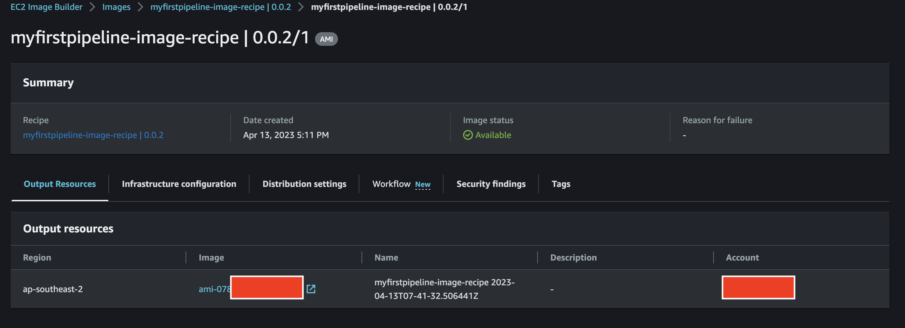

# Using the EC2 Image Builder Terraform Module to create an Windows AMI

This example will use the EC2 Image Builder Terraform Module to create an Windows 2022 Core AMI.

The build components are currently all in a single file: win2022build.yaml
The tests components are currently all in a single file: win2022test.yaml

However the module supports providing multiple files, given the parameters build_component_arn and test_component_arn are of list of strings type.

The module cover the creation of the core components of the EC2 Image Builder, like Image Pipeline, Image Recipe, Distribution Configuration,
Infrastructure Configuration, etc, but there are components which needs to be created outside of the module and provide as input, which are basically
what it is going to be executed during the build and test process, and also custom IAM Policy with permissions required to interact with
AWS services related to your build and test components.

This example creates the following resources:

- S3 Bucket
- EC2 Image Builder Build Component, which executes the hello world powershell script
- EC2 Image Builder Test Component, which executes the pester script which tests the output of the powershell hello world script
- S3 Objects, which uploads the build and Test YAML Files to S3
- IAM Policy with permissions to read/write to the S3 Bucket
- VPC/Subnets/Route Tables/Nat Gateway/etc

## How to Deploy

### Prerequisites

Ensure that you have installed the following tools in your Mac or Windows Laptop before start working with this module and run Terraform Plan and Apply

1. [AWS CLI](https://docs.aws.amazon.com/cli/latest/userguide/install-cliv2.html)
2. [Terraform](https://learn.hashicorp.com/tutorials/terraform/install-cli)

### Deployment Steps

#### Step 1: Clone the repo using the command below

```sh
git clone https://github.com/aws-ia/terraform-aws-ec2-image-builder.git
```

#### Step 2: Run Terraform INIT

Initialize a working directory with configuration files

```sh
cd examples/windows/
terraform init
```

#### Step 3: Run Terraform PLAN

Verify the resources created by this execution

```sh
export AWS_REGION=<ENTER YOUR REGION>   # default set to `us-west-2`
terraform plan
```

#### Step 4: Finally, Terraform APPLY

Create the resources

```sh
terraform apply
```

Enter `yes` to apply.

#### Step 5: Verify the AMI on AWS Console

Output of Terraform apply should look similar

```
module.ec2-image-builder.aws_imagebuilder_image.imagebuilder_image[0]: Creation complete after 1h3m56s [id=arn:aws:imagebuilder:ap-southeast-2:XXXXXXXX:image/myfirstpipeline-image-recipe/0.0.2/1]
```

Login to AWS Console, go to the AWS Region where resources are deployed, and go to the location showed on the Terraform output, for example:

EC2 Image Builder > Images > "myfirstpipeline-image-recipe 0.0.2" > "myfirstpipeline-image-recipe 0.0.2/1"
You can see the AMI ID on the output resources:



## Cleanup

To clean up your environment, destroy the Terraform module.

*NOTE:* Empty the S3 bucket created by this module before executing the `terraform destroy`

```sh
terraform destroy -auto-approve
```
